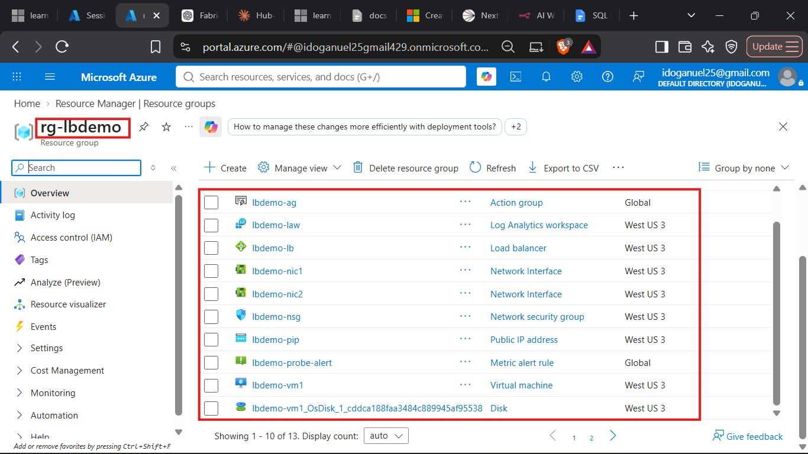
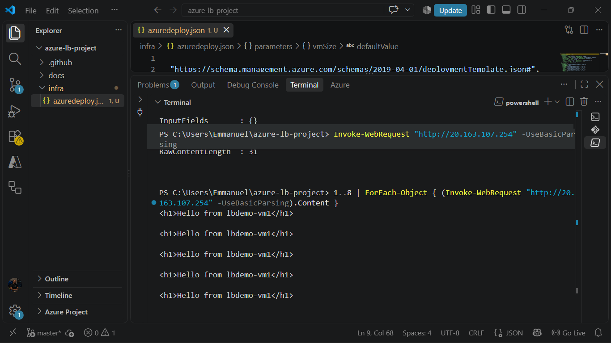
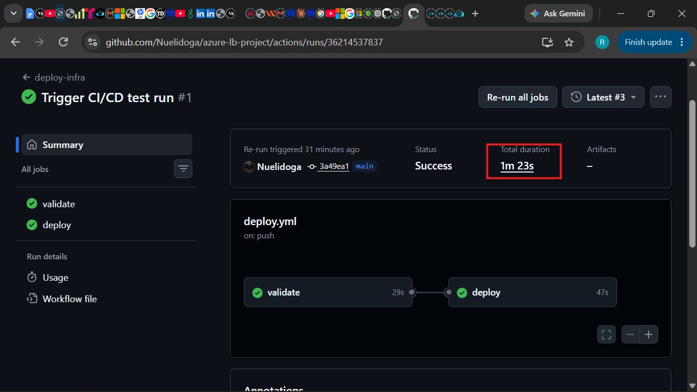
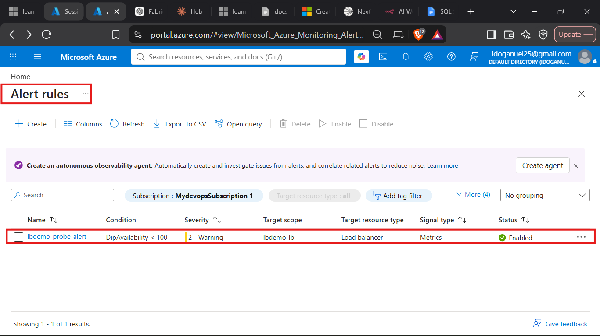
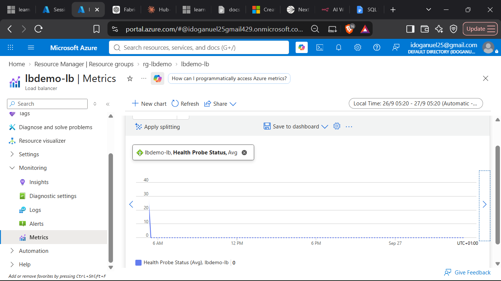
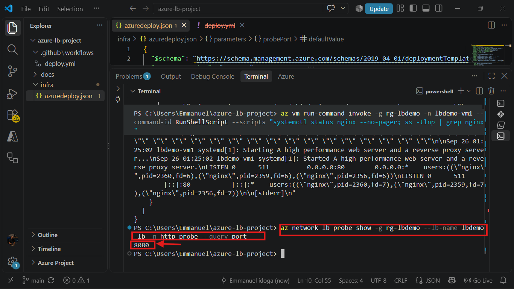
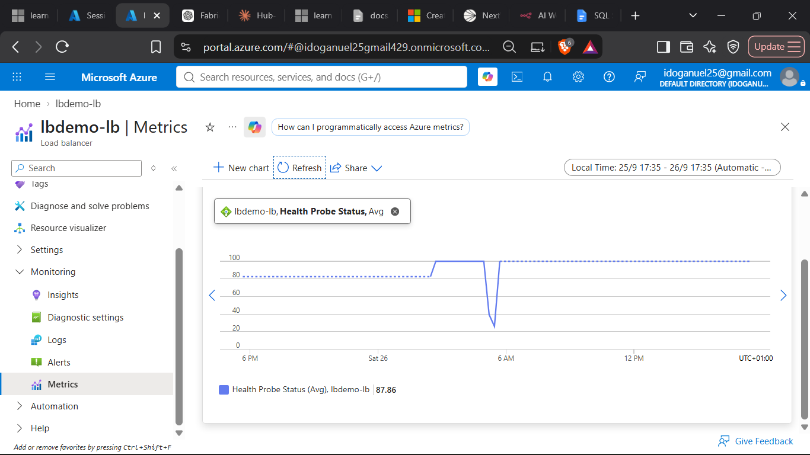
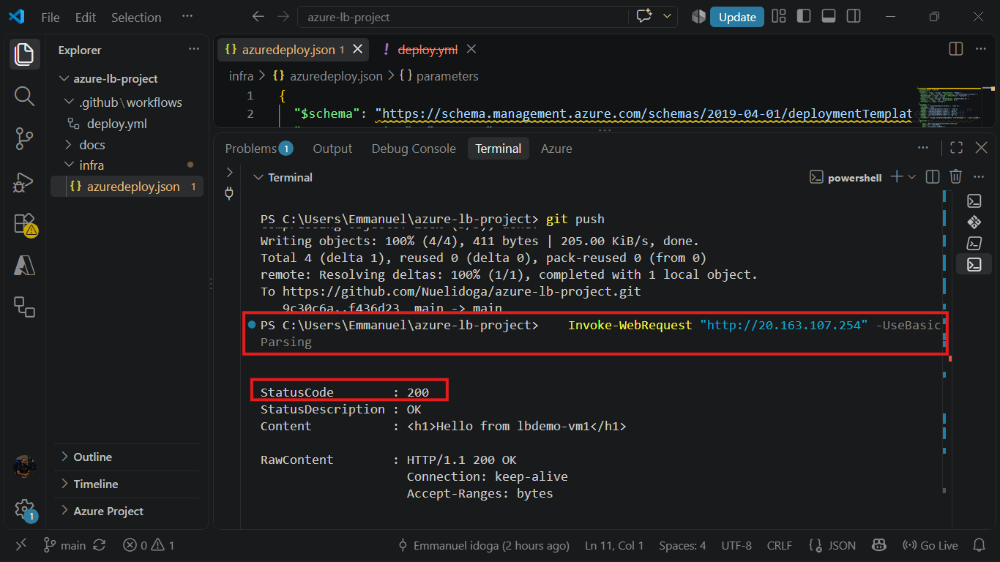

# Azure Load Balancer Demo: ARM Templates, GitHub Actions CI/CD, and a Deliberate Outage

A load-balanced, two-VM web service on Azure, provisioned entirely with an ARM template, deployed through GitHub Actions, and monitored with Azure Monitor. Then I broke it on purpose, troubleshot it, and wrote up the incident.

**Skills demonstrated:** Infrastructure as Code (ARM), Azure networking (VNet, NSG, Standard Load Balancer), CI/CD (GitHub Actions, service principal auth), monitoring and alerting (Azure Monitor), incident response and post-incident documentation.

## Architecture

```
Internet
   |
Public IP (Standard, static)
   |
Standard Load Balancer  (health probe on port 80)
   |
Backend pool
   |-- lbdemo-vm1 (Ubuntu 22.04, nginx)
   '-- lbdemo-vm2 (Ubuntu 22.04, nginx)
        in one subnet, no public IPs, NSG allows inbound port 80
```

Monitoring: Log Analytics workspace, a metric alert on the load balancer's `DipAvailability`, and an action group that emails on failure.



## Repo structure

```
.
├── infra/azuredeploy.json          # ARM template (all resources)
├── .github/workflows/deploy.yml    # validate -> what-if -> deploy
└── docs/
    ├── incident-report.md          # full incident write-up
    └── images/                     # screenshots used in this README
```

## AWS to Azure mapping

| AWS concept | Azure equivalent |
|---|---|
| VPC, subnets, security groups | Virtual Network, subnet, NSG |
| EC2 instances | Ubuntu VMs (cloud-init installs nginx) |
| Elastic Load Balancer | Azure Standard Load Balancer |
| Terraform | ARM template, deployed with Azure CLI |
| CodePipeline / Actions | GitHub Actions with `azure/login` |
| CloudWatch | Azure Monitor (Log Analytics, metric alerts, action groups) |

## Deploy it yourself

Prerequisites: Azure CLI, an Azure subscription, an SSH key pair.

```powershell
az login
az group create -n rg-lbdemo -l <region>
$key = Get-Content $HOME\.ssh\id_ed25519.pub -Raw

az deployment group validate -g rg-lbdemo -f infra/azuredeploy.json -p sshPublicKey="$key" alertEmail="you@example.com"
az deployment group what-if  -g rg-lbdemo -f infra/azuredeploy.json -p sshPublicKey="$key" alertEmail="you@example.com"
az deployment group create   -g rg-lbdemo -f infra/azuredeploy.json -p sshPublicKey="$key" alertEmail="you@example.com"
```

Browse to the load balancer's public IP. Refreshing should show the hostname alternate between the two VMs.



## CI/CD

`.github/workflows/deploy.yml` runs on changes under `infra/**`:

1. **validate**: `az deployment group validate` and `what-if` (also on pull requests)
2. **deploy**: `az deployment group create`, only on push to `main`

Authentication uses a service principal scoped to a single resource group, stored as GitHub secrets: `AZURE_CREDENTIALS`, `SSH_PUBLIC_KEY`, `ALERT_EMAIL`.



## The incident: a green pipeline and a dead site

I changed the health probe port in the template from `80` to `8080` and pushed it. Validation, what-if, and deploy all passed. The site went down, because nginx listens on 80 and the load balancer began probing a port nothing listens on, marking every backend unhealthy.

An alert rule watches for this:



Health Probe Status dropped to zero:



**Troubleshooting path**

1. Confirmed the outage externally (request timed out).
2. Ruled out the VMs: nginx active and listening on port 80.
3. Inspected the load balancer probe directly and found port `8080`:



4. Matched the timing to the offending commit in `git log`.
5. Fixed it with `git revert`, pushed through the same pipeline.

Recovery:





Outage window: about 21 minutes. Full timeline, root cause, and prevention plan: [docs/incident-report.md](docs/incident-report.md).

## Lessons learned

- A successful deployment is not a healthy system. `validate` and `what-if` check the template, not application behaviour.
- Infrastructure as code turns a fix into a one-line revert.
- Monitoring told me where to look before I touched a single VM.

## Next steps

- Add a post-deploy smoke test that requests the public endpoint and fails the job unless it returns 200.
- Add an approval gate between `what-if` and `deploy`.
- Alert on Data Path Availability as well as probe status.
- Move from a stored client secret to OIDC federated credentials.
- Ship nginx logs to Log Analytics and query them with KQL.

## Cleanup

```powershell
az group delete -n rg-lbdemo --yes --no-wait
```

## Write-up

Full walkthrough with screenshots: https://medium.com/@idoganuel25/i-broke-my-own-azure-infrastructure-on-purpose-heres-what-it-taught-me-about-real-world-devops-9c1030bf6d0f
